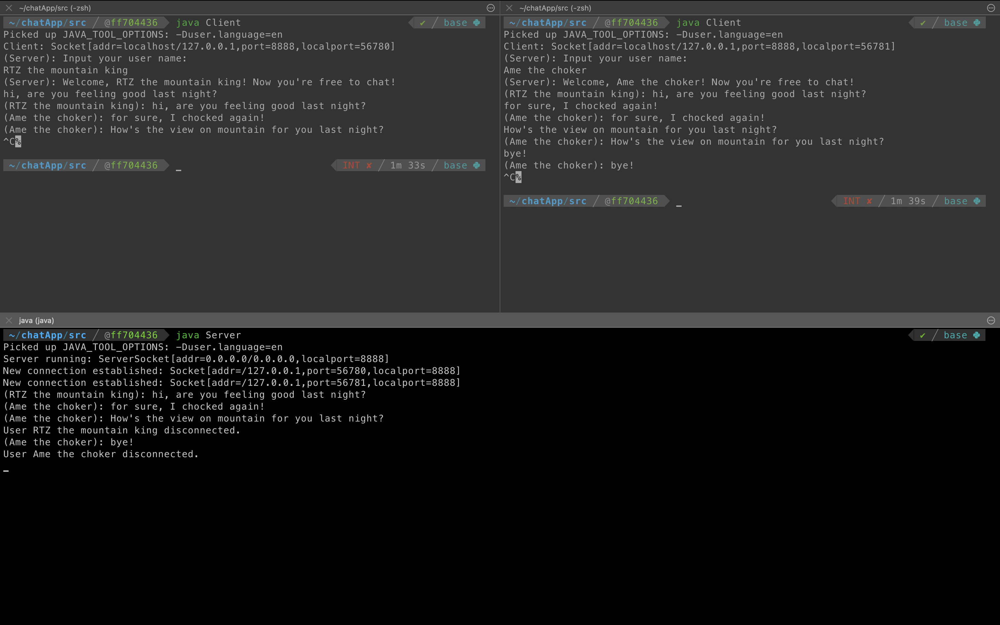
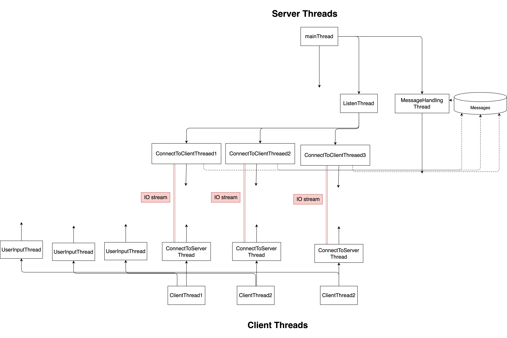

# A simple JAVA chat app based on socket


 


## How to run this chatApp:

launch server (must be done first):

```sh
cd ~/chatApp/src
javac Server.java
java Server
```

launch clients (as many as you want) in another terminal

```sh
cd ~/chatApp/src
javac Client.java
java Client
```


## How this code works

  

## 写代码时遇到的问题

##### client 怎么做到一边 listen to server 一边 listen to user input?

创建多个进程,  `ConnectToServerThread` 负责和 server` 沟通, `UserInputThread` 负责读取用户的输入.

##### server 怎么做到把一条消息发送给所有的 clients?

在 server 中需要用容器存储所有的 `clientSocket` (或是存储所有创建的`ConnectToClientThread`), 在需要把消息发送给所有 clients 时遍历容器中的所有线程, 访问对应的 `outputStream` 即可

##### 怎么debug多线程的程序?

使用vscode自带的debugger就可以, 但我用的不是很好, 有很多功能还需要掌握.

##### server closed

当 server 关闭 (在对应终端按下 `ctrl` + `c` 即可) 时每一个client 所对应的`ConnectToServerThread` 中的 `run`方法都会抛出一个 `EOFException` (现实中发生该异常的原因有很多, 例如网络连接中断, 不一定是服务器关闭, 但是由于我们目前只是在本地测试, 所以该异常的原因基本只有服务器关闭)

##### client closed

当某个client关闭时, 会在 server 内显示信息 `User xxx has disconnected`.  和上面的原因类似, server 中的 `ConnectToClientThread` 会抛出 `EOFException`异常

##### client 和 server 怎么传输用户信息?

这个问题是我在写代码时遇到的最大困难. 我在server和client中都用`LinkedBlockingQueue<?> messages`  这个结构来存储收发的信息, 一开始存储的类型只是单纯的 `Object`(能够直接 `System.out.println(Object)`). 但是后来我希望能够用自己定义的类型来保存额外的信息(例如用户姓名, 发送该条信息的时间...), 这样就能够在 server 或者 client 中用 `msg.getUserName()` 类似语句来获取该条语句的信息了.

但是我先后遇到了2个问题:

1. 当我用 ` out.writeObject(new Message(userName, messageContent))` 时会抛出 `NotSerializableException`

[Why does writeObject throw java.io.NotSerializableException and how do I fix it?](https://stackoverflow.com/questions/13895867/why-does-writeobject-throw-java-io-notserializableexception-and-how-do-i-fix-it)

2. `PriorityBlockingQueue` 返回数据并且进行类型转换时报 `ClassCastException`

[ClassCastException when using PriorityBlockingQueue](https://stackoverflow.com/questions/45021519/classcastexception-when-using-priorityblockingqueue)


## Todo

- [ ] Put this on remote server instead of localhost
- [ ] Use build tool instead of manually compile all the files to run server and client
- [ ] Create GUI to seperate chat room and input content
- [ ] Show time of each message
- [ ] Accept image/video and other type of files
- [ ] Test message burst on server


## Reference

[Sending a message to all clients (Client - Server communication)](https://stackoverflow.com/questions/13115784/sending-a-message-to-all-clients-client-server-communication)

[Oracle socket tutorial](https://docs.oracle.com/javase/tutorial/networking/sockets/index.html)
